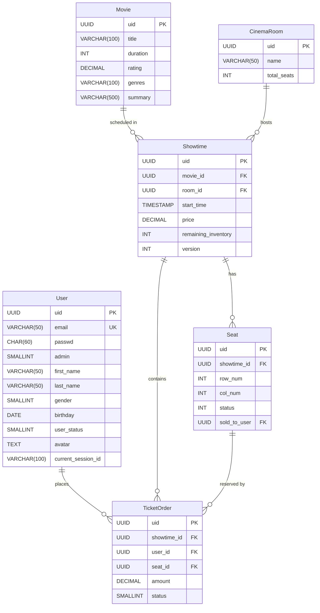
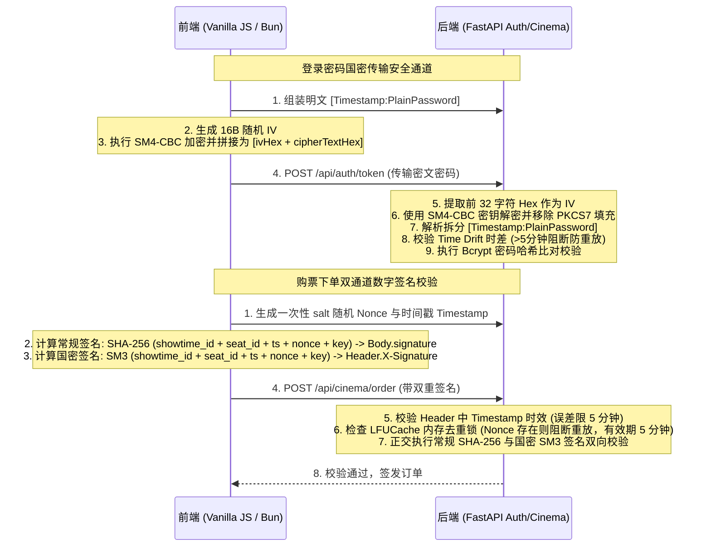
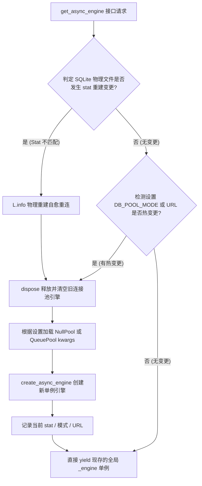

# helloFastAPI System Specification (SPEC)

## Status: HARDENED & COMPLETED (System Architectural Design)

> 本文档规定了项目的底层基建、技术栈选择及代码范式。**所有开发任务必须受限于此文档，禁止 AI 擅自引入本文档未许可的框架或第三方库。**

## 1. 系统整体架构与数据实体关联 (ERD)

### 1.1 环境与包管理器
- **Python 环境**：强制使用 **`uv`**（依赖同步：`uv add <pkg>`，执行指令：`uv run <cmd>`）。绝对禁止使用 `pip`、`conda`、`poetry`、`pipenv`。
- **前端/JS 编译**：强制使用 **`bun`**（依赖同步：`bun install`，执行指令：`bun run <cmd>`）。绝对禁止使用 `npm`、`yarn`、`pnpm`。

### 1.2 后端 API 服务
- FastAPI | Uvicorn | Loguru 结构化日志

### 1.3 异步 ORM 引擎
- SQLAlchemy 2.0+ 异步体系 | `aiosqlite` (SQLite)

### 1.4 前端 UI 界面
- Bootstrap | FontAwesome | Vanilla JS

### 1.5 数据实体关联关系图 (Entity Relationship Diagram)


## 2. 数字安全链路与国密防御体系 (Security Architecture)

系统在登录与购票两大敏感入口部署了高安全强度的防篡改、防重放数字安全防守线。



---

## 3. 高并发一致性与锁退化防御 (Concurrency Control)

靶场购票下单接口位于 `src/Cinema/router.py` 的 `create_booking_order`。其并发一致性协议设计如下：

### 3.1 锁模式行为规格 (Locking Schemes)
*   **无锁模式 (`none`)**：直接进行普通 `SELECT` 并扣减库存 `COMMIT`。高并发下发生严重的“同一座位被多人购买”的物理超卖。
*   **悲观锁模式 (`pessimistic`)**：
    - 设计初衷：通过 `WITH FOR UPDATE` 锁住行记录。
    - **SQLite 物理退化隐患**：SQLite 底层为文件锁，**不支持行级锁 (`FOR UPDATE`)**。在 Python 异步 SQLite 驱动下，`WITH FOR UPDATE` 会被物理引擎静默忽略。因此，在 SQLite 数据库中，悲观锁会**静默退化为常规的无锁模式**，高并发竞争同一座位时依然会发生物理超卖。
*   **乐观锁模式 (`optimistic`)**：
    - 实现策略：基于 CAS 版本号更新（在 `Showtime` 表中维护自增的 `version` 字段）。
    - 校验规则：
      ```sql
      UPDATE showtime 
      SET remaining_inventory = remaining_inventory - 1, version = version + 1 
      WHERE uid = :showtime_id AND version = :old_version;
      ```
      同时修改座位状态：
      ```sql
      UPDATE seat 
      SET status = 1, sold_to_user = :user_id 
      WHERE uid = :seat_id AND status = 0;
      ```
    - 在任一更新中若 `rowcount == 0`，代表被并发竞争者抢占，立即回滚并抛出 `ConflictException` (HTTP 409)，100% 击退超卖。

### 3.2 联合唯一幂等防线
系统在订单表 `TicketOrder` 建立了 `showtime_id` + `seat_id` 的**物理联合唯一性索引** (`uq_showtime_seat`)。即便上层锁模式由于底层引擎缺陷意外失效，在最后的 commit 阶段，数据库也会强制抛出唯一性约束冲突并安全 rollback 事务，从物理底层保障一致性。

---

## 4. 数据库连接池自愈与热重载单例 (Engine Lifecycle)

在 `dependencies.py` 中引入了全局自愈型 `AsyncEngine` 管理架构，保证高并发下长连接池的高效复用：



*   **NullPool (禁用池)**：当 `DB_POOL_MODE = "null"`，切换为 NullPool。每次 HTTP 请求事务结束后自动释放关闭底层连接，适合低并发或开发清理。
*   **QueuePool (启用池)**：当 `DB_POOL_MODE = "queue"`，切换为 QueuePool。维持 `pool_size = 100`、`max_overflow = 200` 的长连接，提供极其平滑的高吞吐吞吐量。
